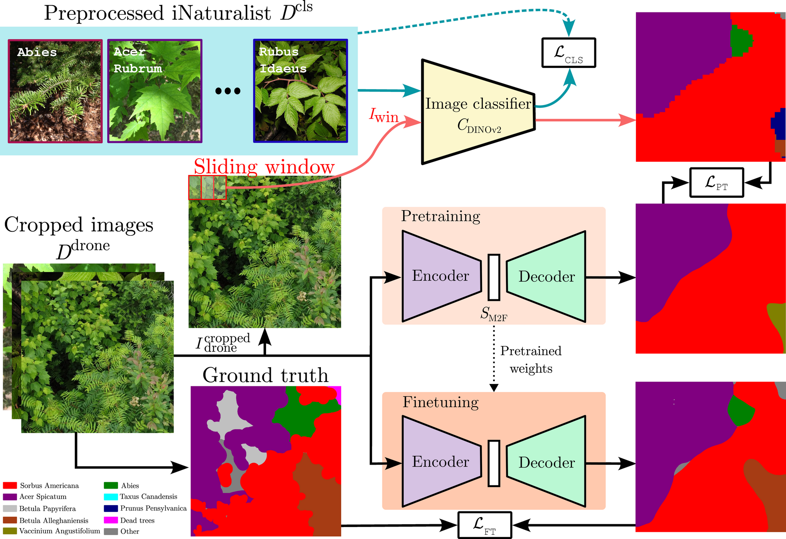

# Using Citizen Science Data as Pre-Training for Semantic Segmentation of High-Resolution UAV Images for Natural Forests Post-Disturbance Assessment

[](https://doi.org/10.3390/f16040616)



> **Using Citizen Science Data as Pre-Training for Semantic Segmentation of High-Resolution UAV Images for Natural Forests Post-Disturbance Assessment**\
> Kamyar Nasiri, William Guimont-Martin, Damien LaRocque, Gabriel Jeanson, Hugo Bellemare-Vallières, Vincent Grondin, Philippe Bournival, Julie Lessard, Guillaume Drolet, Jean-Daniel Sylvain and Philippe Giguère
\
> Paper: https://www.mdpi.com/1999-4907/16/4/616

This repo contains the source code and the datasets used in our paper _Using Citizen Science Data as Pre-Training for Semantic Segmentation of High-Resolution UAV Images for Natural Forests Post-Disturbance Assessment_, published in the [_Classification of Forest Tree Species Using Remote Sensing Technologies: Latest Advances and Improvements_](https://www.mdpi.com/journal/forests/special_issues/S1W916IYIU) special issue of the [_Forests_](https://www.mdpi.com/journal/forests) MDPI journal.

## Repository organization

The repository is composed of two main directories:

<!-- TODO: Complete, following the cleaned version of the repo -->

* [`lowAltitude_classification`](lowAltitude_classification) contains the code for the image classifier $C_{\text{DINOv2}}$
* [`lowAltitude_segmentation`](lowAltitude_segmentation) contains the code for the segmentation model $S_{\text{M2F}}$

### Installation

To ease the installation of the dependencies and the training of the models, we provide two Dockerfiles, [`DockerfileClassif`](DockerfileClassif) and [`DockerfileSeg`](DockerfileSeg), respectively, for the image classifier and the segmentation model. We provide `make` commands to build the containers.

With `docker`:
```sh
make cls-build # Image classifier
make seg-build # Segmentation model
```

With `podman`:
```sh
make cls-podbuild # Image classifier
make seg-podbuild # Segmentation model
```

<!-- TODO: Continue text -->

<!-- We also provide a `Dockerfile` and a `DockerfileGPU` to build a Docker image with all the dependencies.

```sh
# Build the Docker image
docker build -t borealtc-gpu -f DockerfileGPU .

# Run the Docker image
docker run --gpus all -e CUDA_VISIBLE_DEVICES=$CUDA_VISIBLE_DEVICES --rm --ipc host \
	  --mount type=bind,source=.,target=/code/ \
	  --mount type=bind,source=/dev/shm,target=/dev/shm \
	  borealtc-gpu python3 main.py
``` -->

## Citation

If you use the code or data in an academic context, please cite the following work:

```bibtex
@article{Nasiri2025,
  title          = {{Using Citizen Science Data as Pre-Training for Semantic Segmentation of High-Resolution UAV Images for Natural Forests Post-Disturbance Assessment}},
  author         = {Kamyar Nasiri and William Guimont-Martin and Damien LaRocque and Gabriel Jeanson and Hugo Bellemare-Vallières and Vincent Grondin and Philippe Bournival and Julie Lessard and Guillaume Drolet and Jean-Daniel Sylvain and Philippe Giguère},
  journal        = {Forests},
  year           = {2025},
  volume         = {16},
  number         = {4},
  article-number = {616},
  doi            = {10.3390/f16040616},
  url            = {https://www.mdpi.com/1999-4907/16/4/616}
}
```


<!--
```shell
# Classif
buildah build -t droneseg_cls --layers -f DockerfileClassif .

export CUDA_VISIBLE_DEVICES=3
podman run --gpus all --rm --ipc host -it \
  -e CUDA_VISIBLE_DEVICES=$CUDA_VISIBLE_DEVICES \
  -v .:/app \
  -v ./data \
  -v ./data/iNaturalist_split:/home/kamyar/Documents/filtered_inat_split/ \
  -v output:/home/kamyar/PycharmProjects/droneSegmentation/lowAltitude_classification \
  -v /dev/shm/:/dev/shm/ \
  droneseg_cls bash

docker build -t droneseg_cls -f DockerfileClassif .
export CUDA_VISIBLE_DEVICES=3
docker run --gpus all --rm --ipc host -it \
  -e CUDA_VISIBLE_DEVICES=$CUDA_VISIBLE_DEVICES \
  -v .:/app \
  -v ./data \
  -v /data/droneseg/iNat_Classifier_filtered:/app/data/iNat_Classifier_filtered \
  -v output_cls_aug4:/home/kamyar/PycharmProjects/droneSegmentation/lowAltitude_classification \
  -v /dev/shm/:/dev/shm/ \
  droneseg_cls bash
PYTHONPATH=. python3 lowAltitude_classification/Augmentation_iNat_classifier/iNat_Classifier_Augment4.py
PYTHONPATH=. python3 lowAltitude_classification/Augmentation_iNat_classifier/iNat_Classifier_Augment3.py
PYTHONPATH=. python3 lowAltitude_classification/Augmentation_iNat_classifier/iNat_Classifier_Augment2.py
PYTHONPATH=. python3 lowAltitude_classification/Augmentation_iNat_classifier/iNat_Classifier_Augment1.py

podman run --device nvidia.com/gpu=all --rm --ipc host -it \
  -v .:/app \
  -v ~/Datasets/Drone_Unlabeled_Dataset_Patch_split:/data/Unlabeled_Drone_Dataset/Drone_Unlabeled_Dataset_Patch_split \
  -v ~/Datasets/Best_classifier_Weight:/data/Best_classifier_Weight \
  -v ~/Datasets/droneOut:/data/droneSegResults/ \
  -v output:/home/kamyar/PycharmProjects/droneSegmentation/lowAltitude_classification \
  -v /dev/shm/:/dev/shm/ \
  droneseg_cls bash

docker run --gpus=all --rm --ipc host -it \
  -v .:/app \
  -v ~/Datasets/Drone_Unlabeled_Dataset_Patch_split:/data/Unlabeled_Drone_Dataset/Drone_Unlabeled_Dataset_Patch_split \
  -v ~/Datasets/Best_classifier_Weight:/data/Best_classifier_Weight \
  -v ~/Datasets/droneOut:/data/droneSegResults/ \
  -v output:/home/kamyar/PycharmProjects/droneSegmentation/lowAltitude_classification \
  -v /dev/shm/:/dev/shm/ \
  droneseg_cls bash

SPLIT="Fifth batch" python lowAltitude_classification/Pseudo_dataset_LA_Classification_Fast.py
SPLIT="Third batch" python lowAltitude_classification/Pseudo_dataset_LA_Classification_Fast.py

# Seg
buildah build -t droneseg_seg --layers -f DockerfileSeg .

export CUDA_VISIBLE_DEVICES=3
podman run --gpus all --devices nvidia.com/gpu=all --rm --ipc host -it \
  -e CUDA_VISIBLE_DEVICES=$CUDA_VISIBLE_DEVICES \
  -v .:/app \
  -v ./data \
  -v ./data/iNaturalist_split:/home/kamyar/Documents/filtered_inat_split/ \
  -v output:/home/kamyar/PycharmProjects/droneSegmentation/lowAltitude_classification \
  -v /dev/shm/:/dev/shm/ \
  droneseg_seg bash

sftp mamba-server
pwd , lpwd
put -r 'iNaturalist_split/'

cd ~/droneSegmentation
ln -s ~/Datasets/iNaturalist_split/ data/iNaturalist_split

# iNat
python lowAltitude_classification/Dinov2_iNaturalist_classification_fine-tuning.py

# Mask2Former
# Need to compile pixel_decoder in the container
cd lowAltitude_segmentation/Mask2Former/mask2former/modeling/pixel_decoder/ops/ && sh make.sh && cd -

python lowAltitude_segmentation/Mask2Former/train_net.py --config-file configs/Drone_regrowth/semantic-segmentation/swin/maskformer2_swin_large_IN21k_384_bs16_160k_res640.yaml --eval-only MODEL.WEIGHTS data/weights/model_0104999.pth
python lowAltitude_segmentation/Mask2Former/train_net.py   --config-file configs/Drone_regrowth/semantic-segmentation/swin/maskformer2_swin_large_IN21k_384_bs16_160k_res640.yaml   --eval-only MODEL.WEIGHTS /home/kamyar/PycharmProjects/droneSegmentation/lowAltitude_segmentation/Mask2Former/output/model_0104999.pth
```
-->
